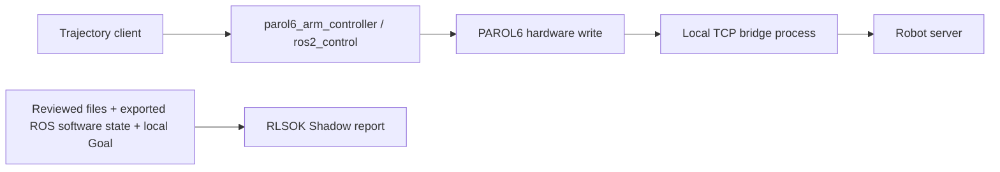
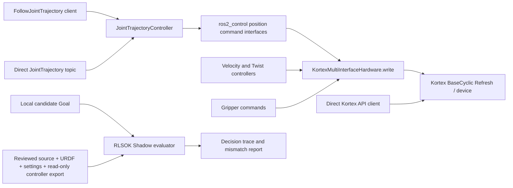

# Configuration feedback: runnable evaluation and command boundaries

This guide accompanies v1.5.0-shadow.6. It describes public-source preparation and local software experiments, not customer use, vendor approval or physical robot compatibility. RLSOK Shadow evaluates a local candidate against an explicitly reviewed configuration; it does not intercept an application's commands.

## SO-101: change the same arm controller's type

The reference is [so101_ros2 at 0305e03a](https://github.com/adoodevv/so101_ros2/tree/0305e03ab54e64aae9263fcbf339622e654012f3). The simulation launch is `ros2 launch so101_gazebo so101.gazebo.launch.py`. An RViz description launch alone does not instantiate this command path. The public `arm_controller` is a JointTrajectoryController with ordered joints `shoulder_pan`, `shoulder_lift`, `elbow_flex`, `wrist_flex`, `wrist_roll`.

Prepare the specifically requested alternative configuration:

```sh
rlsok profile prepare-so101-swap \
  --input "$CHECKOUT/so101_moveit_config/config/so101/ros2_controllers.yaml" \
  --output reviewed-position-controllers.yaml
```

This creates a new file. It retains `arm_controller` as the name, changes its plugin to `position_controllers/JointGroupPositionController`, retains the five joints in order, removes JTC-only arm parameters and preserves the gripper manager entry and parameter block. It refuses a different starting arm type/joint order or missing gripper configuration. Review the generated file; RLSOK does not load or switch it.

Use the `so101-arm` baseline/refresh procedure in [source workspaces](source-shadow-workspaces.md). In an isolated simulation, the operator first captures the active JTC baseline, approves that baseline, then stops/unloads only `arm_controller`, changes its configured type, and loads the same name from the reviewed copy. Leave `gripper_controller` active and unmodified. Export `arm_controller` again and refresh the workspace with that export. Do not reuse a stale export or approve the changed configuration. A separate, explicit mock-hardware experiment is provided below for environments with no Gazebo model installed.

```sh
rlsok profile compare-controllers --baseline baseline-controller.json \
  --changed changed-controller.json --output controller-difference
```

The new report shows controller type/state/claims, lost or changed action endpoints and each changed parameter, with both verified configuration hashes. It is a historical explanation; it creates neither approval nor a freshness decision. The existing `profile compare` separately evaluates both observations and reports WOULD_ALLOW/WOULD_BLOCK under the original approval. After the requested swap the old trajectory action is gone: the changed report must show configuration mismatch and missing path coverage. Five unchanged joint names do not mean the old action interface still exists.

The leader serial bridge publishing `/joint_states` for RViz bypasses `arm_controller`. It is outside this action evaluation, as are gripper and direct command topics. The earlier same-type replacement experiment did not establish this new type-change result.

## PAROL6: a concrete first experiment

The `parol6-arm` recipe maps [grahas/parol6_ros2_control at c111b97d](https://github.com/grahas/parol6_ros2_control/tree/c111b97d5afd00b9b04d593bb11ab52ba67dc6cd). It selects `/parol6_arm_controller/follow_joint_trajectory`, JTC, and `L1` through `L6` in that order. It copies the controller/launch/control-Xacro/tool-Xacro and hardware/bridge/protocol source listed by `profile source-recipes`.



The Python bridge is a plain process, not a ROS command subscriber. Hardware `write()` calls `bridge_.exchange(kOpUpdate, ...)` after its guards; source hashes do not authenticate the live bridge/server. Homing and other out-of-band operations are separate from the trajectory action.

For the first evaluation use an already isolated controller environment with physical transport unreachable. Do not start `parol6_control.launch.py` just to discover metadata: it can start the real bridge. Required inputs are your exact checkout/current differences, expanded URDF including the chosen external PAROL6 model/tool, actual launch/bridge settings, a fresh controller export and one local Goal sample. The Xacro relies on an external `parol6` description package, so an invented placeholder model cannot represent your robot.

```sh
rlsok profile export-controller --manager /controller_manager \
  --controller parol6_arm_controller --node /parol6_arm_controller \
  --output baseline-controller.json
rlsok profile prepare-source --recipe parol6-arm --source "$CHECKOUT" \
  --catalog catalog.json --controller-state baseline-controller.json \
  --urdf expanded.urdf --settings runtime-settings.json --example goal.json \
  --device-id parol6-isolated-review --output parol6-review
```

Follow the existing approval/capture/refresh/compare steps. For an initial file-drift experiment, alter one reviewed bridge setting in a **copied** settings file and refresh with that copy. The result establishes that the declared setting changed, not that the robot server used it. A live-controller experiment needs fresh exports and its own isolated setup. Share a redacted comparison only if useful; no machine access or credentials are needed.

## Gen3 seven-axis prototype and the Kortex boundary

The `kinova-gen3-7dof` recipe is pinned to the official [Jazzy source at 462dab9a](https://github.com/Kinovarobotics/ros2_kortex/tree/462dab9aa4732d733be55e1846530dd920c7c7d3). It selects the unprefixed `joint_trajectory_controller`, joints `joint_1` through `joint_7`, and `/joint_trajectory_controller/follow_joint_trajectory`. Prefixes, six-axis/Lite variants and other controllers require their own reviewed mapping.



The diagram deliberately shows **no RLSOK edge in the live write path**. The prototype is a parallel evaluator at the declared ROS trajectory-action boundary. It reads metadata/files and a local candidate. It does not gate `write()`, intercept the direct trajectory topic, call BaseCyclic, or cover arbitrary Kortex API clients. The pinned driver also has gripper and Twist writes. Inserting an actual execution gate would require separately designing and reviewing all those write paths and failure modes; this release does not implement or claim that interception.

Prototype preparation uses `profile prepare-source --recipe kinova-gen3-7dof` with the same actual inputs as PAROL6, exporting `--controller joint_trajectory_controller --node /joint_trajectory_controller`. A seven-axis Goal is a JSON object with `trajectory.joint_names` in the above order and `trajectory.points` containing seven finite positions and strictly increasing `time_from_start`. It stays local.

For a reproducible **software-only** prototype, the [mock controller experiment](../experimental/composable-shadow/feedback_controller_experiment.py) starts the installed JTC on `mock_components/GenericSystem`, discovers its actual action type, prepares/reviews a workspace, captures a baseline, deactivates that controller, captures the changed state and compares under the same approval. Its simple fixture links are not Gen3 kinematics, and the Kortex physical driver is never loaded. This demonstrates the evaluator/ROS controller connection; it leaves the vendor's architectural review and real-device behavior open.

## Run the bounded mock experiments

Use an isolated Linux/ROS Jazzy environment with `controller_manager`, `joint_trajectory_controller`, `position_controllers`, `mock_components`, Python `rclpy`/PyYAML and Node >=22.12 installed. Download dependencies and the pinned source beforehand. Build the RLSOK checkout once with `npm run build`. No hardware bringup or SDK is required. The script refuses an occupied discovery domain at startup and always constructs GenericSystem hardware. It switches only the test controller and publishes only the fixture robot description, never a motion Goal or velocity/position command.

```sh
source /opt/ros/jazzy/setup.bash
python3 experimental/composable-shadow/feedback_controller_experiment.py \
  --recipe so101-arm --runtime "$RLSOK_CHECKOUT" --source "$SO101_CHECKOUT" \
  --node "$(command -v node)" --output "$NEW_RESULT_DIRECTORY"
# For the seven-axis prototype, use --recipe kinova-gen3-7dof and its pinned checkout.
```

Read `summary.json`, `controller-diff/controller-comparison.md` and `comparison/{baseline,changed}/report.json`. The script asserts the original approval/profile/sample stayed unchanged and both evaluator reports have zero dispatch. For SO-101 it also asserts the changed active type, same five claims and unchanged gripper configuration/state. Running this script is an explicit simulation experiment; ordinary RLSOK collection never switches controllers.

## Other public ROS paths

For the confirmed rover source `1384dbbc` and `ros2 launch rover_bringup rover.launch.xml`, the existing `rover-gazebo` recipe remains the next step. Select the actual bridge node from discovery with `--subscriber`; do not substitute the FSM or a logger. No additional rover feature is inferred from agreement to try it. Full Gazebo/FSM behavior remains unvalidated here.

For the hexapod, keep the stages separate: isolated Gazebo `/cmd_vel -> hexapod_gait -> gait/KDL/IK -> joint controller`, then a future physical backend. The existing `hexapod-gait` recipe checks only the first input and selected source/configuration. An upgrade to Pi4/PWM/DS3225/BNO055/camera does not authorize inventing an actuator driver or calibrations. Confirm the upgraded simulation branch/launch/parameter differences before applying its old `656eebab` mapping. Replacing the physical backend need not replace gait/IK; its actual interface remains to be supplied by its owner.

The `xarm1s-moveit-arm` recipe prepares the five-joint MoveIt arm action from [3836e35a](https://github.com/allProgramming/ros2_xarm_1s_demos/tree/3836e35a61064af2810c7d6174b5d5e841b1bf7b), excluding the `arm1` hand. That repository also contains a distinct bare ros2_control configuration with six joints and different controller names. The recipe does not silently treat those as interchangeable. Source preparation requires no visit or hardware restoration; which setup is available now remains unknown.

## ODrive alternative platform: what determines integration

ODrive S1 plus BLDC hub motors identifies hardware, not the application's command boundary. For a different rover, do not reuse an unavailable research platform's configuration. RLSOK needs a small description of (1) where the candidate command originates, (2) its ROS topic/action/service or SDK/CAN transport and receiving process, (3) message fields, units/frame and wheel/axis mapping, (4) the launch/configuration/calibration facts the operator wants reviewed, and (5) one local candidate and observations of the current software setup. Public source links and redacted local files are enough for initial review; credentials are unnecessary.

An existing `geometry_msgs/Twist` or `TwistStamped` boundary can use [generic interface onboarding](interface-onboarding.md), selecting the actual receiver and frame. A raw CAN frame, ODrive SDK function or custom service is not automatically a supported Twist endpoint and needs a separately defined adapter. Shadow checks the chosen inputs locally and outputs a reasoned comparison. It neither drives the motors nor proves that an ECU loaded the reviewed settings. This same written architecture can be reviewed asynchronously without a meeting.

## Design, reviewed facts and a decision trace

The design question is narrow: “Does this candidate match the particular software configuration that a named reviewer approved, using observations fresh enough for the declared policy?” The profile explicitly lists paths and facts; there is no assumption that a successful build proves runtime correctness.

1. Prepare a profile binding selected model/source/settings hashes, ROS environment, interface fingerprint, receiver or controller state, and required candidate checks.
2. The reviewer inspects that exact profile and records an approval with an expiry. A changed profile needs a new review.
3. Collect fresh local evidence and check the candidate against that approved profile. The report exposes each check, expected/observed values, reason and resulting decision.
4. An unchanged baseline may report WOULD_ALLOW. Change a reviewed calibration/settings file and capture again under the same approval: its fact reports a mismatch and the result is WOULD_BLOCK. Stale evidence, missing interfaces or invalid candidates also block for their own reasons; those reasons must not be confused with the intended change.

The working [`profile demo`](local-shadow-first-evaluation.md) and source-workspace comparison provide local examples. An unstable external topology/trace plugin is not needed to read or reproduce this decision flow. File hashes establish exact bytes; they do not establish physical position, calibration truth, device identity, loaded binaries or successful execution. A self-attested software configuration match is not a physical safety proof, and no one must disrupt an active project to read it.

For DBC, declaring the reviewed `.dbc` as a file fact can detect byte changes even if generated software still compiles. It does not parse signal semantics, determine whether the active decoder used that file, or attest ECU firmware. Those are separate facts/integrations; this feedback does not establish a requirement for a new DBC parser.

HuNavSim updates simulated **humans**. `/human_states` and `/robot_states` supply information; they are not robot dispatch endpoints. The robot's policy/controller chain consumes selected information and issues its own commands in the underlying simulator. Any robot command review belongs at that separately identified boundary. This release adds no HuNavSim command adapter.

For the propulsor project's reviewed limits, mission intake and Dynamixel dispatch, see the [source review and patch](pliant-propulsors-review.md). No generic Twist mapping stands in for its mission-to-servo logic.
